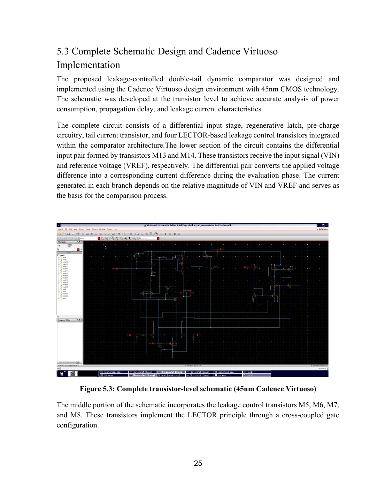
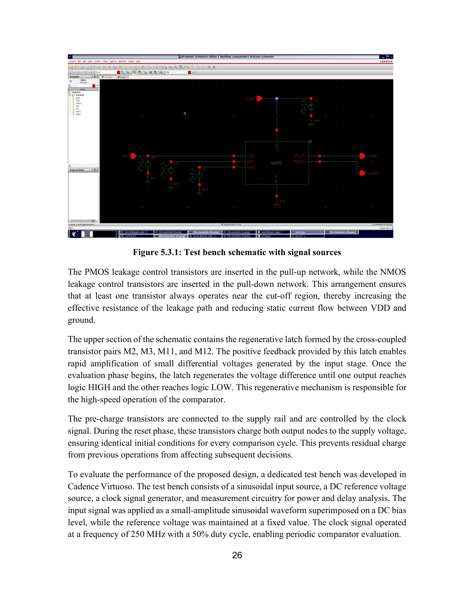
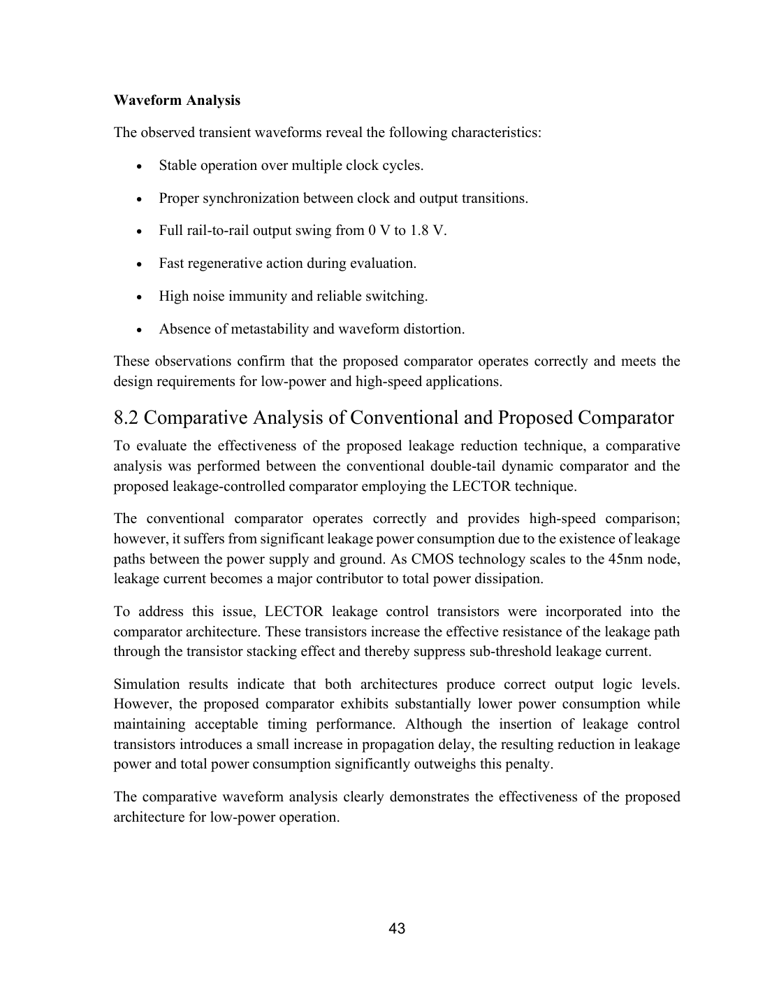
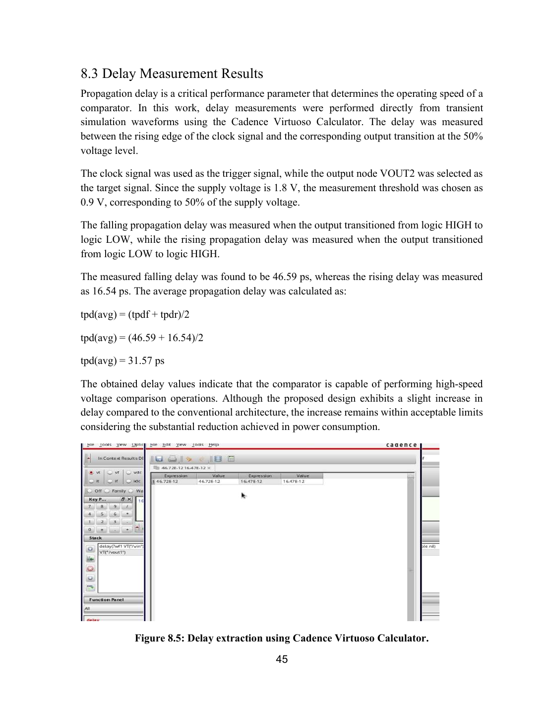
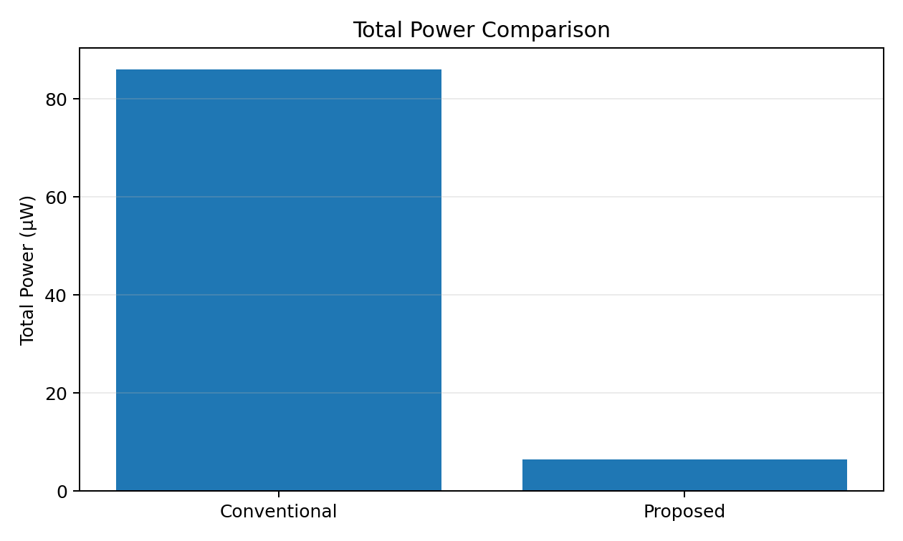
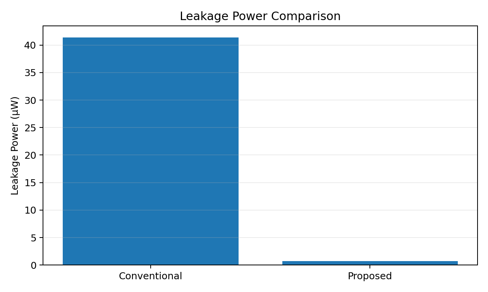
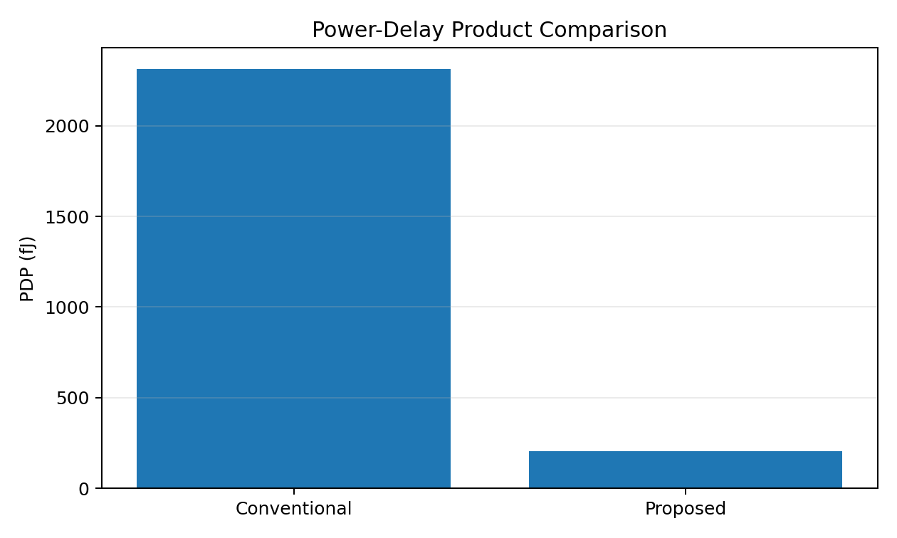
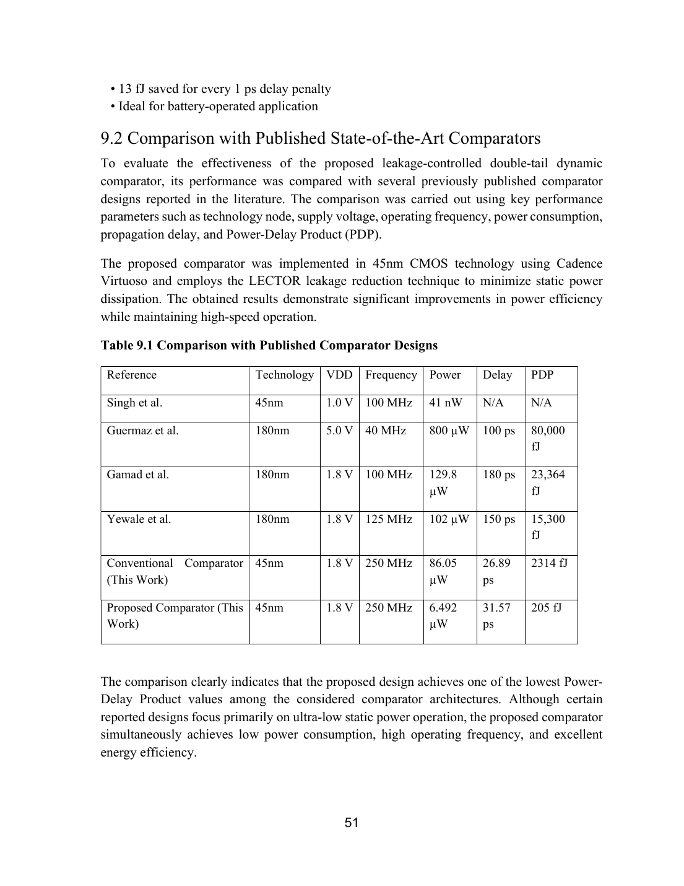

# Leakage-Controlled Dynamic Comparator Using 45nm CMOS

[](https://github.com/)
[](https://www.cadence.com/)
[](https://www.cadence.com/)
[](https://github.com/)

## Overview

This project presents the **design and analysis of a low-power, high-speed leakage-controlled dynamic comparator for ADC applications**.

The proposed architecture is a **double-tail dynamic latch comparator** implemented in **45nm CMOS** and enhanced using the **LECTOR (LEakage Control TransistOR) technique**. The objective is to reduce sub-threshold leakage and overall power while retaining high-speed comparator operation.

The design was developed and simulated in **Cadence Virtuoso/Spectre** using a 45nm CMOS technology environment.

> **Repository scope:** This repository is a professional portfolio/research record. Proprietary foundry/PDK files, Cadence installation files, license files, and machine-generated simulation databases are intentionally not included.

---

## Key Results

| Metric | Conventional | Proposed | Result |
|---|---:|---:|---:|
| Total Power | 86.05 µW | **6.492 µW** | **92.46% reduction** |
| Leakage Power | 41.4 µW | **0.75 µW** | **98.17% reduction** |
| Average Delay | 26.89 ps | **31.57 ps** | Small delay penalty |
| PDP | 2314 fJ | **205 fJ** | **91.14% improvement** |
| Operating Frequency | 250 MHz | **250 MHz** | Maintained |
| Energy per Cycle | — | **25.96 fJ** | Proposed result |

### Main contribution

The reported results show a large reduction in leakage and total power while retaining 250 MHz operation. The proposed design has a modest delay penalty but a substantially lower Power-Delay Product.

---

## Architecture

The proposed comparator combines:

1. Differential input stage
2. Regenerative latch
3. Pre-charge/reset network
4. Tail control
5. LECTOR leakage-control transistor pairs

The LECTOR devices exploit transistor stacking to increase effective leakage-path resistance and suppress sub-threshold leakage.

### Transistor-Level Implementation



### Cadence Testbench



---

## Design Methodology

```text
45nm CMOS Technology
        ↓
Conventional Dynamic Comparator
        ↓
LECTOR Leakage-Control Integration
        ↓
Transistor-Level Schematic
        ↓
Cadence Virtuoso Testbench
        ↓
Spectre Transient Simulation
        ├── Functional Verification
        ├── Power Analysis
        ├── Leakage Analysis
        └── Delay / PDP Analysis
                ↓
       Conventional vs Proposed
                ↓
           Final Results
```

---

## Simulation Setup

| Parameter | Reported Value |
|---|---:|
| Technology | 45nm CMOS |
| Technology Library | GPDK045 |
| Supply Voltage | 1.8 V |
| Operating Frequency | 250 MHz |
| Clock Period | 4 ns |
| Clock Pulse Width | 2 ns |
| Clock Duty Cycle | 50% |
| Clock Rise/Fall | 100 ps |
| Simulator | Cadence Spectre |
| Design Environment | Cadence Virtuoso |
| Main Analysis | Transient |

The reported testbench uses a differential input around a common-mode level of 0.9 V and a 250 MHz clock with a 50% duty cycle.

---

## Simulation Results

### Transient Response



### Delay Measurement



Reported delay values:

- Falling delay: **46.59 ps**
- Rising delay: **16.54 ps**
- Average delay: **31.57 ps**

### Power and PDP







---

## Power Breakdown

| Component | Conventional | Proposed | Reduction |
|---|---:|---:|---:|
| Dynamic Power | 45.10 µW | 3.04 µW | 93.3% |
| Short-Circuit Power | 0.46 µW | 0.46 µW | 0% |
| Leakage Power | 41.40 µW | 0.75 µW | 98.2% |
| Other | 0 µW | 2.25 µW | — |
| **Total** | **86.05 µW** | **6.492 µW** | **92.46%** |

See [`results/`](results/) for machine-readable CSV data.

---

## Comparison With Published Designs



The comparison uses the benchmark values presented in the submitted project report. They are included here as **report-sourced values** and have not been independently re-verified in this repository.

---

## Repository Structure

```text
.
├── README.md
├── CITATION.cff
├── GITHUB_UPLOAD_CHECKLIST.md
├── LICENSE-NOTICE.md
├── docs/
│   ├── project-report.pdf
│   ├── project-summary.md
│   ├── reproducibility.md
│   └── report-review-note.md
├── cadence/
│   ├── schematic/
│   ├── testbench/
│   ├── netlist/
│   └── simulation_setup/
├── simulations/
│   ├── transient/
│   ├── power/
│   ├── delay/
│   └── leakage/
├── results/
│   ├── comparison.csv
│   ├── power-breakdown.csv
│   ├── project-metadata.json
│   └── figures/
├── images/
└── references/
```

---

## Technology / PDK Notice

The report identifies **GPDK045** and BSIM4-based transistor modeling as part of the 45nm implementation environment.

This repository intentionally excludes:

- GPDK045/foundry PDK files
- Restricted BSIM model files
- Cadence installation files
- License files
- Machine-specific Cadence configuration
- Large PSF/raw simulation databases

Reproduction therefore requires an appropriately licensed Cadence environment and authorized technology library.

---

## Limitations

The submitted report states that the present work is simulation-based and was not fabricated in silicon. It also identifies the absence of post-layout parasitic effects, detailed Monte Carlo mismatch analysis, comprehensive PVT characterization, and full offset characterization.

These limitations should be considered when interpreting the reported results.

---

## Future Work

The report proposes:

- Layout implementation with DRC/LVS
- Post-layout simulation
- Silicon fabrication and measurement
- PVT and Monte Carlo analysis
- Advanced technology-node investigation
- SAR/Flash/Pipeline ADC integration
- Offset calibration
- Combining LECTOR with other leakage-reduction techniques
- Design/transistor-sizing optimization
- Low-power IoT, biomedical, and wearable integration

---

## Documentation

- [Complete Project Report](docs/project-report.pdf)
- [Project Summary](docs/project-summary.md)
- [Reproducibility Guide](docs/reproducibility.md)
- [Results](results/)
- [Cadence Notes](cadence/)

---

## Author

**Macharla Sai**  
M.Tech — VLSI System Design

**Project areas:** VLSI, Mixed-Signal IC Design, Low-Power CMOS, ADC Comparator Design

---

## Citation

See [`CITATION.cff`](CITATION.cff) for citation metadata.

## Disclaimer

This is an academic project portfolio record. Reported results depend on the stated technology environment, circuit configuration, simulation settings, and measurement methodology. The repository does not claim silicon-level validation.
